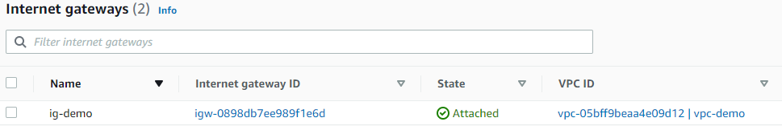
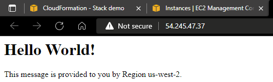

# VPC and EC2 Examples
Understanding CloudFormation with basic templates.

## EC2 and VPC Basic
Basic EC2 with a VPC with minimal features.

### Diagram

### Result

### Parameters

### VPC

### Subnet

### Internet Gateway

### Route Table

### Result with mapping us-west-2
